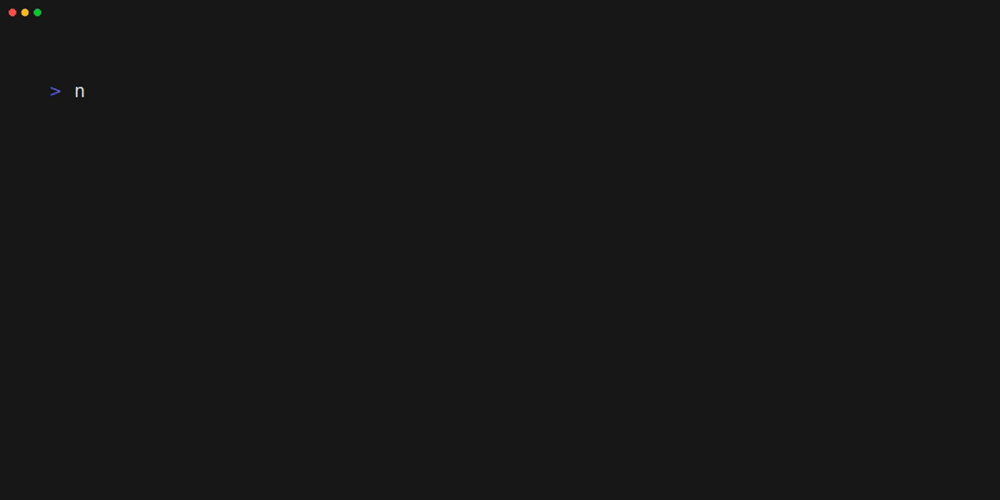

# LocalContact

A TypeScript-based contact management system with REST API support. This project provides both CLI and API interfaces for managing user contacts locally with authentication support.

## Features

### CLI Interface
- Add new contacts with name and email validation
- Edit existing contact information
- Search contacts by name or email
- Remove contacts with confirmation
- View all contacts in a tabulated format
- Data persistence between sessions

### REST API
- Swagger UI documentation
- Bearer token authentication
- Endpoints for:
  - Getting all users (`GET /users/get`)
  - Searching users (`GET /users/search`)
  - Adding new users (`POST /user/`)
  - Saving user data (`POST /users/save`)
  - Deleting users (`DELETE /user/:userid`)
  - Editing users (`PUT /user/:userid`)

### Security Features
- JWT-based authentication system
- Token management with refresh and access tokens
- Token caching for improved performance
- Token verification and validation
- Configurable token algorithm and secret

## Tech Stack
- TypeScript/JavaScript
- Fastify for REST API
- Jose for JWT handling

## Installation

```bash
# Clone the repository
git clone https://github.com/TheDanikReal/localcontact.git

# Install dependencies
npm install

# Start TUI
npm start

# Or start API
npm run api
```
